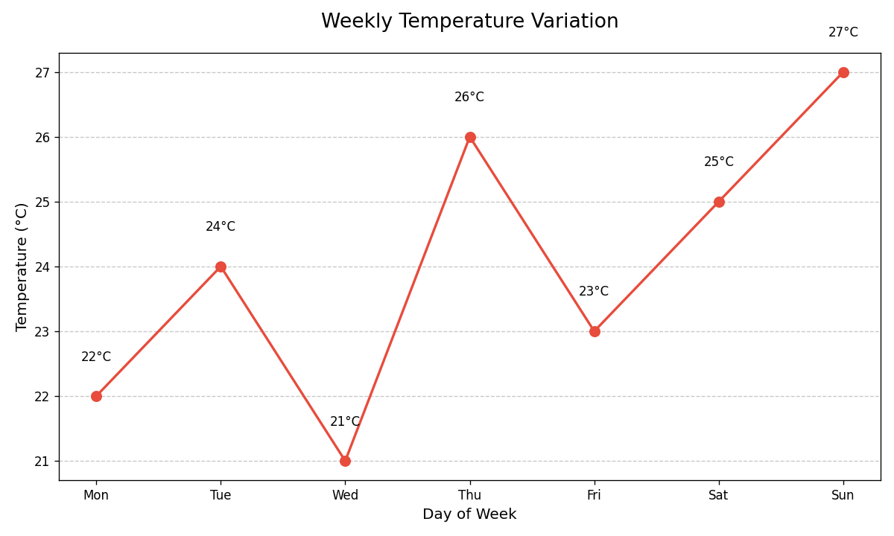

# 🌡️ Weekly Temperature Tracker



A beginner-friendly Python project that visualizes daily temperature fluctuations using matplotlib. Perfect for learning basic data visualization!

## ✨ Features

- **Clean Line Graph**: Visualize temperature trends across a week
- **Smart Annotations**: Each data point shows exact temperature
- **Customizable Design**: Change colors, markers, and sizes easily
- **Publication Ready**: Save high-resolution PNG images
- **Beginner Friendly**: Simple code structure with clear comments

## 🛠️ Requirements

- Python 3.6+
- matplotlib (`pip install matplotlib`)

## 🚀 Quick Start

1. Clone the repository:
   ```bash
   git clone https://github.com/Kirankumarvel/Simple-Temperature-Tracker.git
   cd temperature-tracker
   ```

2. Install dependencies:
   ```bash
   pip install -r requirements.txt
   ```

3. Run the visualization:
   ```bash
   python temperature_plot.py
   ```

## 📊 Customizing Your Data

Edit these variables in `temperature_plot.py`:
```python
days = ['Mon', 'Tue', 'Wed', 'Thu', 'Fri', 'Sat', 'Sun']
temperatures = [22, 24, 21, 26, 23, 25, 27]  # Replace with your data
```

For styling changes, modify:
```python
color='#E74C3C'      # Change line color
marker='o'           # Change marker style
markersize=8         # Adjust marker size
```

## 📚 Learning Objectives

This project helps you master:
- Creating line graphs with matplotlib
- Adding value annotations
- Customizing grid lines
- Saving visualizations
- Basic data plotting principles

## 🌟 Pro Tips

- Record real temperatures for a week for authentic data
- Try different marker styles (`, `s`, `D`, `^`)
- Experiment with color schemes
- Add a subtitle with location/date information

## 🤝 Contributing

Suggestions welcome! Potential enhancements:
- Add average temperature line
- Incorporate weather icons
- Create multi-week comparisons
- Accept CSV input files

## 📜 License

MIT License - Free for personal and educational use

---

**Temperature Tracking Tip**: Run this weekly to visualize seasonal changes! ❄️🌞
```
